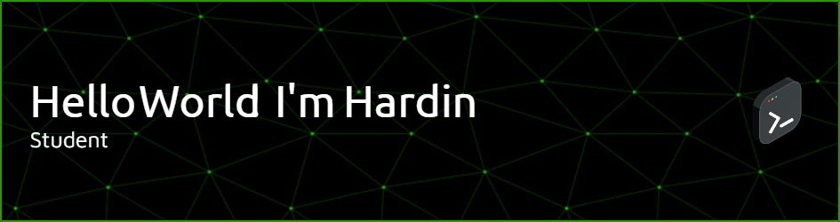

## 🌐 Socials:
  

# 💻 Tech Stack:
## Programming Languages
     

## Frameworks & Libraries
         

## Databases & Cloud
    

## Tools & Platforms
      

## Design & Graphics
  

# 📊 GitHub Stats:
 
 

## 🏆 GitHub Trophies

---

  
<!-- Proudly created with GPRM ( https://gprm.itsvg.in ) -->