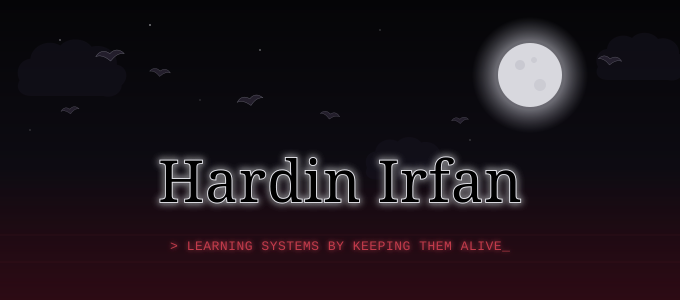

<div align="center">
  
</div>

<br>

```bash
$ whoami
> Application Support & Monitoring at Accelist Lentera Indonesia
> Handling incidents, SQL patches, and uptime for Toyota Astra Motor's supply chain
> Building incidentra on the side — an AI-assisted take on the same problem
> Still early career, still figuring out which direction to specialize in
```

New here, jack of a few trades right now: application support, a bit of security research, some ML experiments, a bit of frontend. `incidentra` is where the day job and the side projects meet — automating the kind of incident triage I already do manually at work.

### currently working with

`Python` `SQL Server` `JavaScript` `TypeScript` `React` `PHP` `PostgreSQL`

### contribution activity

<div align="center">

<picture>
  <source media="(prefers-color-scheme: dark)" srcset="https://raw.githubusercontent.com/HardInCode/HardInCode/output/github-contribution-grid-snake-dark.svg">
  <source media="(prefers-color-scheme: light)" srcset="https://raw.githubusercontent.com/HardInCode/HardInCode/output/github-contribution-grid-snake.svg">
  
</picture>

</div>
